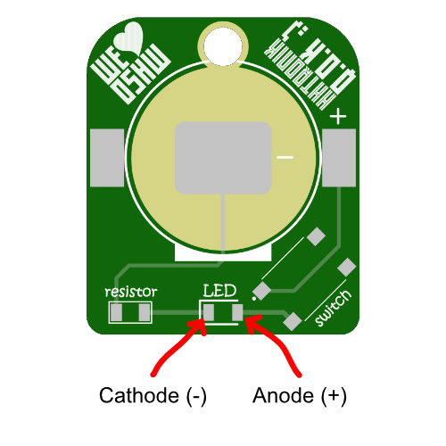

HHTronik Q.O.K. / I learn soldering SMD
=======================================


Want to learn soldering SMD (Surface Mount Devices) components? Then this is for you! **I learn soldering SMD** is a super simple kit designed to give you a (relatively) pain-free crash course in that topic!

When completed you'll have soldered this circuit:

```

	            battery
	           + | |  -
	+------------||||---------------+
	|            | |                |
	|                               |
	|    _                          |
	+---/  ------->|-----/\/\/\-----+
	  switch     LED    resistor

```

...which is basically the most simple flash light circuit you can think of. Press the switch and current flows from the battery through the LED and resistor. 

What equipement do I need?
--------------------------

- A soldering iron, preferably one with a thin tip
- Some solder, again, thinner one (< 1mm) will make your life easier
- Fine tip tweezers
- Patience if this is your first time soldering SMD

As always, work safety is important, so don't burn yourself and don't inhale the fumes released while soldering. Working in a well ventilated area is good. We'd definitely recommend adding some ventilation (for example a fan of some sort blowing the fumes away from you or a proper soldering fume extractor if you plan on doing this over and over again :)

Optionally you may have these things around:

- some flux
- rubbing alcool or isopropanol
- some lint-free cloth / paper towel
- a multimeter (ideally with a diode test mode)

Assembly mini guide
-------------------

1. Clean the PCB with some rubbing alcool and cloth *(optional but recommended)*
2. Add a bit of solder to one pad of the resistor footprint on the PCB
3. Take the resistor out of its packaging and hold it down with one terminal agains the blob of solder you just added (make sure the other terminal aligns well with the second pad on the PCB)
4. Re-melt the solder while gently holding down the resistor
5. Solder the second terminal to its pad
6. Check if the solder joints look ok (=> touch up with flux then reflow if they don't)
7. Repeat the same for the LED **Watch out the note on LED polarization below!** 
8. Now add a blob of solder to one pad of the switch footprint and tack the switch down so all other pins properly align to the pads on the pcb
9. Solder down the three remaining pins
10. The battery holder has two pins designed to be soldered down and a third retaining bit which prevents the battery from sliding out on that side. Place the battery holder so that the battery will slide out over the key-ring hole - not over the components.
11. Solder down the battery holder last. Don't solder anything to the big central pad of the footprint! **don't burn yourself, the metal part quickly gets super hot - use tweezers**
12. Check all joints (and measure everything if you know how to do that)
13. Insert a battery (the positive pole/+ should face up, away from the PCB) and press the button

**...if the LED lights up, well, congratulations you've completed the kit!**


Troubleshooting
----------------

First of all, this is not a bad thing! The real fun actually just begun. Here are some things you want to check:


- Check if the battery is inserted the right way around (the + sign should be touching the battery holder)
- Check the battery voltage with the multimeter (should be > 2.5V ideally)
- Check all solder joints
- Measure from point to point (testing order matters, start with the fist points):

| Pads / Test points | Multimeter mode       | Expected result            | Repairing it               |
| ------------------ | --------------------- | -------------------------- | -------------------------- |
| `1` (or battery holder metal shell) to `3` | `Continuity` or `resistance` (low range)  | Continuity or < 5 Ohms in resistance test | check the solder joints on the battery holder and switch |
| `1` to `5` | `continuity` or `resistance`  | Continuity (or < 5 Ohms in resistance test) when you press the button | Check the solder joints on the switch |
| `1` to `5` | `continuity` or `resistance`  | No continuity (or O.L. / inifinite resistance) when the button is not pressed | Check for solder bridges arround on the switch |
| `4` to `7` | `diode test`                  | With the positive terminal on `4` and COM/Negative on `7` the LED is expected to turn on. If swapping connections makes the LED light... | ...unsolder the LED and rotate it 180°, it was reversed. |
| `6` to `8` | `resistance`                  | The meter should read approx. 100 Ohm | Verify the solder joints. 


Polarity of LEDs
----------------

**LEDs are polarized components.** This means that their orientation matters. 
Most LEDs have a "cathode mark" which indicates where their "negative pin" is, which is componly 
shown by a green mark on both the cathod contact on the top side and and arrow-like mark on the 
bottom face of the LED.

The PCB footprint for the LED does mark the cathod too (closed side of the "U" shaped silkscreen print)
so you should align those.



Components
----------

| Reference        | Part                        | Notes / Alternative parts  |
| ---------------- | --------------------------- | -------------------------- |
| Battery holder   | `Keystone Electronics 3034` | `Linx Technologies BAT-HLD-001` or `MPD BK-912-TR` or `Q&J WJ-CR2032-1-W`
| Switch           | `C&K PTS645SL50SMTR92`      | Many surface mount tactile switches with a 6x6mm outline
| LED              | `Kingbright APTD3216SRCPRV` | Pretty much any `1206` size red LED
| Resistor         | `Yaego RC1206JR-07100RL`    | Resistor value in kit: 100 Ohm. Alternatively: any `1206` size resistor with the right value (see below)


The acceptable value range for the resistor depends on the current rating of the LED. The `Kingbright APTD3216SRCPRV` is rated for 20mA nominal forward current and has a forward voltage of about 2V.
This means that any resistor bigger than 50 Ohm would we limit the current to 20mA or below with a fresh CR2032 battery. With the kit's 100 Ohms resistor the current will be limited to about 10mA. Any value in that 50 - 100 Ohm range will be fine.


I don't know anything about electronics, what can I learn?
----------------------------------------------------------

Plenty! Besides the art of soldering (there's a list of useful Youtube clips on how to solder SMT parts below) you could try to learn more about the characteristics of resistors or LEDs to
get an understanding for why we need the resistor in this circuit ;) 

If, for example, you'd like to buy another resistor to get a few more photons out of that LED, you could use the formula below to calculate what resistance value results in which current or vice-versa:

```
	Vf  = LED forward voltage = 2.0V (for a typical "high brightness" red LED)
	If  = LED current
	Vcc = battery voltage = 3.0V (for a fresh CR20xx cell)
	R 	= Resistor value

	Calculating R
	-------------

	    Vcc - Vf
	R = --------
	       If

	Calculating If
	--------------

	     Vcc - Vf
	If = --------
            R
```

Want to know why you actually need current limiting the LED? Here's a great writeup: [LED Current Limiting Resistors on Sparkfun.com](https://www.sparkfun.com/tutorials/219)

Watch others do
---------------

Some SMT soldering tutorials worth watching if you've never done this before

[LeoMakes / How to solder surface mount parts (it's easy!) ~ 19min](https://www.youtube.com/watch?v=f9fbqks3BS8)

[Collin's Lab / Surface Mount Soldering ~ 8min](https://www.youtube.com/watch?v=QzoPxvIM2qE)

[Tomislav Darlic / Soldering 1206 resistor ~ 2min](https://www.youtube.com/watch?v=_DsCdOaRUPM)


LICENCE
-------

This project is licenced under CERN Open Hardware Licence Version 2 - Strongly Reciprocal see LICENCE file for the full text.