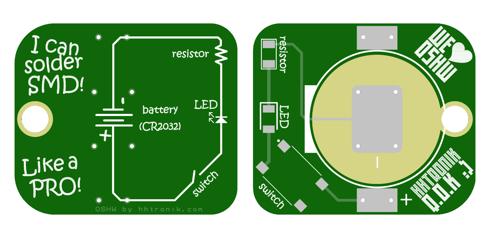

HHTronik Q.O.K. / I learn soldering SMD
=======================================



Want to learn soldering SMD (Surface Mount Devices) components? Then this is for you! **I learn soldering SMD** is a super simple kit designed to give you a (relatively) pain-free crash course in that topic!

When completed you'll have soldered this circuit:

```

	            battery
	           + | |  -
	+------------||||---------------+
	|            | |                |
	|                               |
	|    _                          |
	+---/  ------->|-----/\/\/\-----+
	  switch     LED    resistor

```

...which is basically the most simple flash light circuit you can think of. Press the switch and current flows from the battery through the LED and resistor. 

What equipement do I need?
--------------------------

- A soldering iron, preferably one with a thin tip
- Some solder, again, thinner one (< 1mm) will make your life easier
- Fine tip tweezers
- Patience if this is your first time soldering SMD

As always, work safety is important, so don't burn yourself and don't inhale the fumes released while soldering. Working in a well ventilated area is good. We'd definitely recommend adding some ventilation (for example a fan of some sort blowing the fumes away from you or a proper soldering fume extractor if you plan on doing this over and over again :)

Components
----------

| Reference        | Part                        | Notes / Alternative parts  |
| ---------------- | --------------------------- | -------------------------- |
| Battery holder   | `Keystone Electronics 3034` | `Linx Technologies BAT-HLD-001` or `MPD BK-912-TR` or `Q&J WJ-CR2032-1-W
| Switch           | `C&K PTS645SL50SMTR92`      | Many surface mount tactile switches with a 6x6mm outline
| LED              | `Kingbright APTD3216SRCPRV` | Pretty much any `1206` size red LED
| Resistor         | `Yaego RC1206JR-07100RL`    | Resistor value in kit: 100 Ohm. Alternatively: any `1206` size resistor with the right value (see below)


The acceptable value range for the resistor depends on the current rating of the LED. The `Kingbright APTD3216SRCPRV` is rated for 20mA nominal forward current and has a forward voltage of about 2V.
This means that any resistor bigger than 50 Ohm will we limit the current to 20mA or below. With the kit's 100 Ohms resistor the current will be limited to about 10mA.


I don't know anything about electronics, what can I learn?
----------------------------------------------------------

Plenty! Besides the art of soldering (there's a list of useful Youtube clips on how to solder SMT parts below) you could try to learn more about the characteristics of resistors or LEDs to
get an understanding for why we need the resistor in this circuit ;) 

If, for example, you'd like to buy another resistor to get a few more photons out of that LED, you could use the formula below to calculate what resistance value results in which current or vice-versa:

```
	Vf  = LED forward voltage = 2.0V (for a typical "high brightness" red LED)
	If  = LED current
	Vcc = battery voltage = 3.0V (for a fresh CR20xx cell)
	R 	= Resistor value

	Calculating R
	-------------

	    Vcc - Vf
	R = --------
	       If

	Calculating If
	--------------

	     Vcc - Vf
	If = --------
            R
```

Want to know why you actually need current limiting the LED? Here's a great writeup: [LED Current Limiting Resistors on Sparkfun.com](https://www.sparkfun.com/tutorials/219)

Watch others do
---------------

Some SMT soldering tutorials worth watching if you've never done this before

[LeoMakes / How to solder surface mount parts (it's easy!) ~ 19min](https://www.youtube.com/watch?v=f9fbqks3BS8)

[Collin's Lab / Surface Mount Soldering ~ 8min](https://www.youtube.com/watch?v=QzoPxvIM2qE)

[Tomislav Darlic / Soldering 1206 resistor ~ 2min](https://www.youtube.com/watch?v=_DsCdOaRUPM)

What's in this repository?
--------------------------

You'll find a BOM with comments/notes, a PDF schematic and ECAD design files for DesignSpark PCB (you can download a free copy at )
Software
You open and edit most files by using free or open-source software.

    ECAD: DesignSpark PCB v9 by RS Online
    Mechanical: FreeCad or Fusion360


LICENCE
-------

This part of the Craftalight project is licenced under CERN Open Hardware Licence Version 2 - Strongly Reciprocal see LICENCE file