SMD Soldering 101 / build instructions
======================================

SMD first timer? Cool :D ! Don't worry, getting started with this kit with the "tiny stuff" is 
pretty easy with this kit! 

As you don't have any or much experience with soldering SMD we'll go through some of the lowly basics here.

Safety first: 

- be careful with the soldering and melted solder. They can cause severe burns!
- don't inhale the soldering fumes. 
- wash your hands after soldering. Solder can contain lead, zinc, other metals and flux, neither of which you should ingest!

To solder this board you'll need:

- a soldering iron / most will make do for this job.
- some tweezers
- solder / 1mm with flux/rosin core or anything you're comfy with
- some fire proof surface to solder on

> Note: about the work table you're going to solder on: clean it up and have some space to work.
> Don't have any easy to burn material or substance close. If you don't mind having a burnt trace on it
> most furniture will be *fine* but you may want to add some throw-away-able layer on top ;)
>
> There are some amazing and cheap soldering mats available, otherwise a scrap wood panel will do.

Power up your soldering iron (if it's regulated set the temperature to anywhere between 260°C and 350°C - depending on your solder) and wait for it to be at the right temperature. 

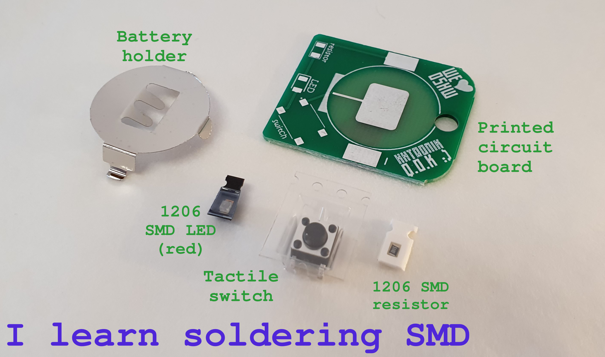

While the soldering iron is heating up, prepare your first part. We'll start with the 1206 (that's a size indication, which in this case is on the *huuuuge* side of SMD things) resistor because it's the easiest one!

Start by removing the cover tape of the carrier (that's the thin clear plastic film which holds the component in the paper or plastic carrier tape). The easiest way is to use the tweezers and slide on side under the cover tape and twist a little bit to loosen one edge, like so:

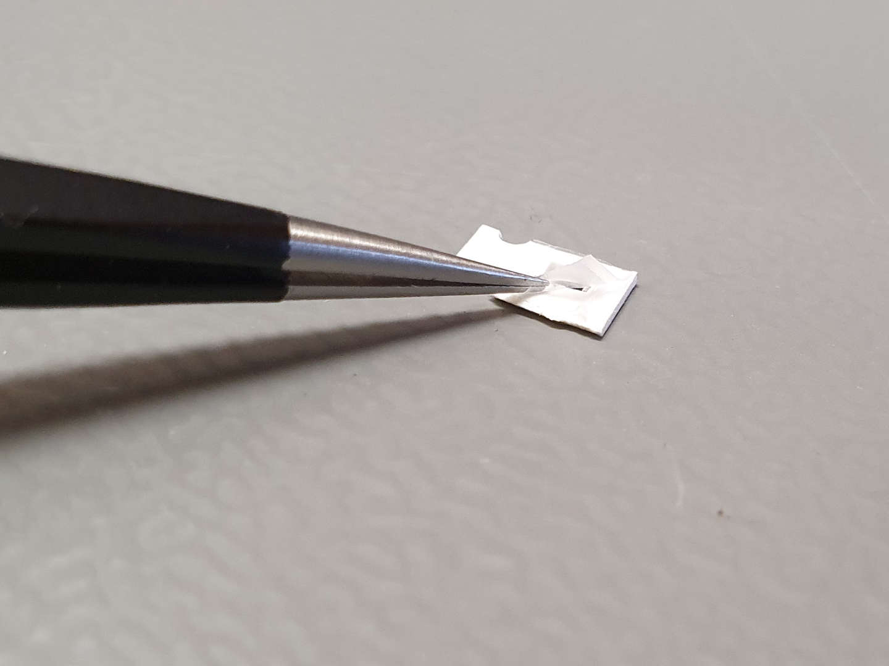

Be careful once you've removed the cover tape: one flick and the resistor will be gone! It's tiny an lightweight.

By now the soldering iron should be up to temperature! You can check this by holding a bit of solder to the tip (keep your fingers at least a couple of centimeters away from the tip though). If the solder niceley melts and flows on the tip you're ready to go! 

If you ended up with a huge blob of solder on the tip of the iron, you can get rid of it by using some solder wick. Alternatively you can gently tap the soldering iron (the whole unit, not the tip) on the work surface to make to molten solder drop off. Be careful with the projections though! It's *hot and molten* metal!

> Note: if the solder makes crackling noises and/or you have flux projections that means that your iron is too hot! 
> If the solder does not melt, then it's either set too low or not yet fully heated up.

Resistors are a great first component to solder because you can't really go wrong with over-heating or melting them, so take your time! 

As SMDs don't have any lead to hold them in place you'll have to solder to metalized pads on the component:

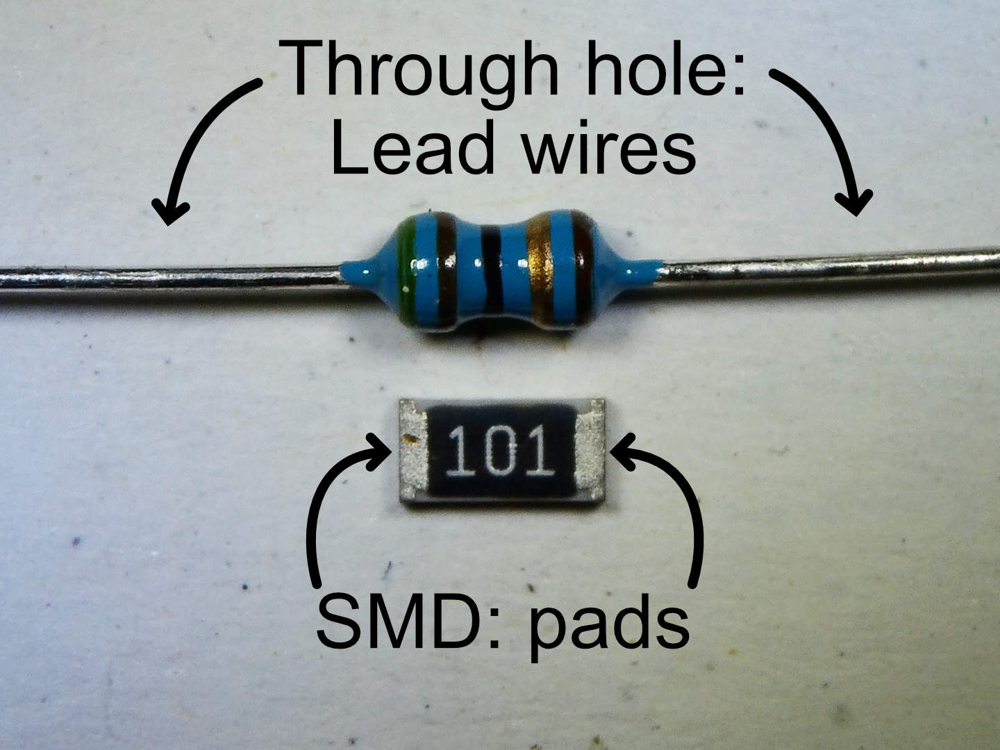

One common way to do this is to slide the component in a pre-wetted solder pad. This means applying a bit of solder to one of the pads of the footprint on the PCB before even grabbing the component with the resistor:

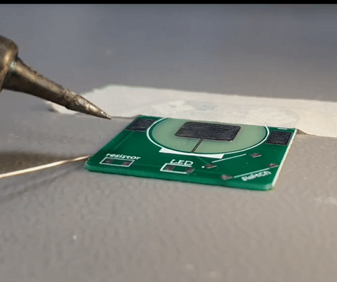

Once you have a nice small solder blob on the pad, grab the resistor with the tweezers (make sure to grab the sides without contact pads). Re-heat the solder blob on the pcb and slide the resistor in place (the second contact should align nicely with the second pad on the PCB):

It's not a problem if you didn't get the alignment right the first time. As long as the second pad isn't soldered it's really easy to change the alignment: just re-flow the solder on the first pad and push the resistor around as you like. Even taking it off the PCB is easy with the tweezers.

Once you're happy with the alignment (you should see enough of the PCB pad to be able to touch it with the tip of the soldering iron basically) flow a bit of solder on the second pad.

This is how it could look like:

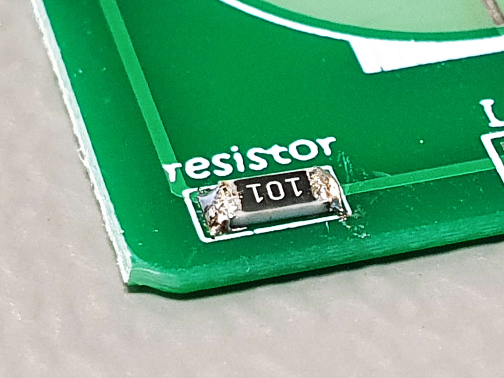

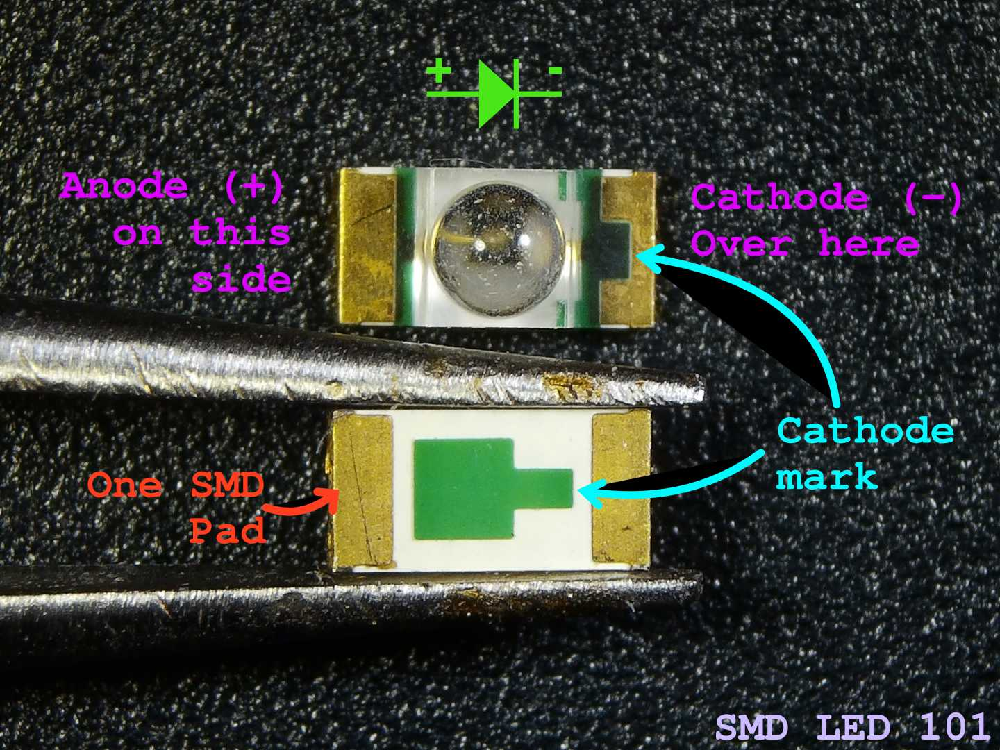

Next it's pretty much *rinse-and-repeat* for the LED, except that it is a polarized component. This means that the orientation you solder it to the PCB matters. This is because they are (Light Emitting) Diodes which can conduct ("pass current") only in one direction. The picture above should help you figure out the polarity of the LED in your kit.

The second thing to know is that LEDs are more sensitive to heat than the resistor you just soldered. This means that you shouldn't hold the soldering iron to its wire for minutes at a time (ideally you should be done in seconds). If you took a long time to solder one of the pads, wait a few seconds to allow it to cool down before moving on!

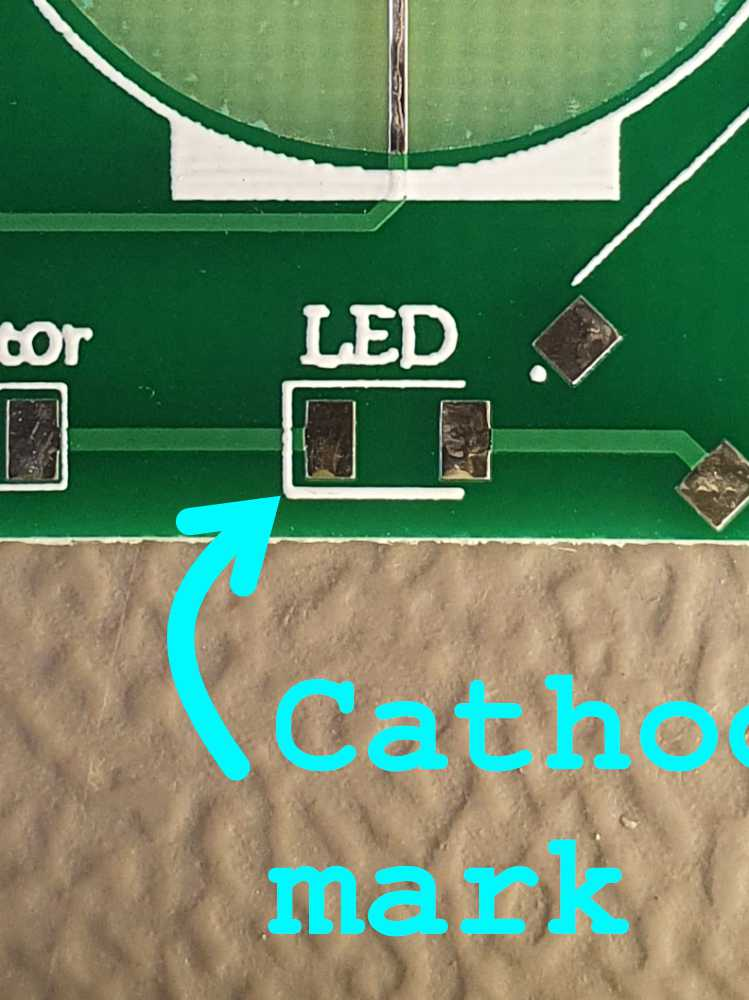

Having a look at the LED footprint on the PCB you'll notice the white marking around the pads. It's not just there to outline the location of the component but also gives you a hint about it's polarity. The closed side of the "U" indicated the cathode pad of the footprint. This means you must align the cathod of the LED with that pad (on the left in the picture above).

The actual soldering is pretty much identical to what you already practiced with the resistor: put a dab of solder on one of the pads, slide the corresponding pad of the LED into the molten solder. Repeat for the second pad if you're happy with the alignment. 

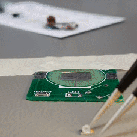

Next up is the tactile switch. It allows you to close the circuit and thus to light the LED when you want it. It's pretty easy to solder, but again, as the case is made out of plastic, you don't want to totally toast it ;) Give it a few seconds to cool down in between the solder joints and you'll be fine!

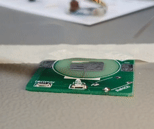

As you can see in the clip I started again by having a blob of solder on one pad and sliding the component into its location after melting that solder. Then I just quickly touch up the four other pads/pins. 

Finally we need to solder the battery holder. This one is a bit tricky because it's a larger piece of metal. This means that it'll soak up quite a bit of heat before reaching a temperature where the solder will nicely flow onto it. What works nice it to use a larger portion of the soldering iron's tip touching on the bend of the contact.

Again, we start with some solder on one of the pads (don't solder the big central pad, it's designed to make contact with the battery direcly later on and a nice and flat surface helps there):

**Be careful to not burn yourself on the metal clip! It stays hot for a bit and conducts heat very well!**

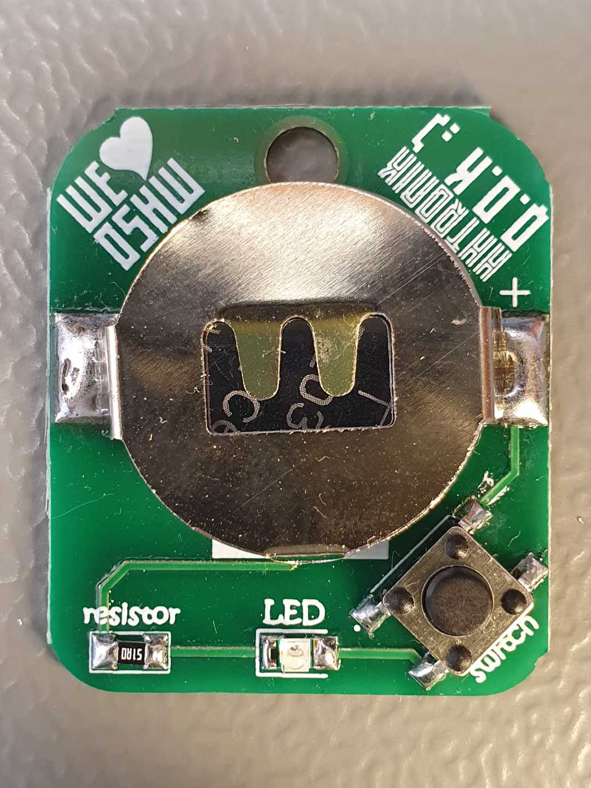

If everything looks fine you can insert a coin cell (positive terminal / + making contact with the metal clip) into the battery holder and press the button.

...and hopefully enjoy your new red keychain flashlight :)

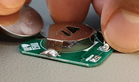

Troubleshooting
===============

Doesn't work? Don't panic and have a look at the troubleshooting section in [README](./README.md)